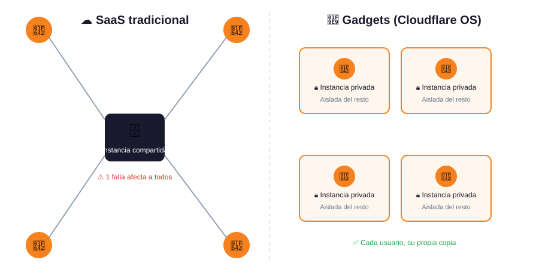
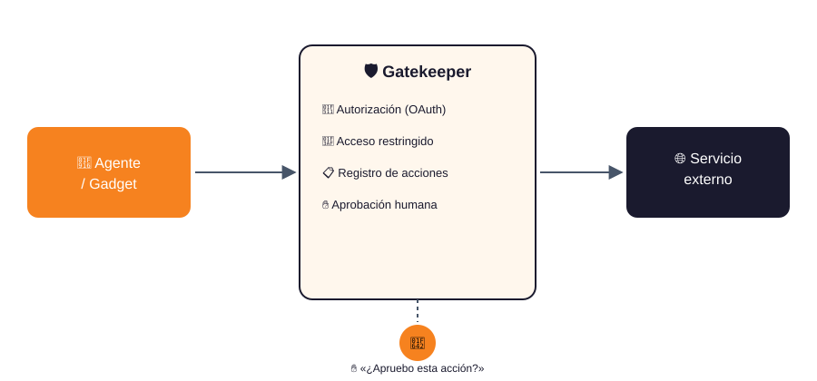

# ☁️ Cloudflare OS: Un entorno de productividad con IA

Cloudflare OS es un sistema operativo para la productividad con IA, desarrollado originalmente para su uso interno en Cloudflare. Gran parte del personal de Cloudflare —desde ingeniería hasta ventas y todos los demás departamentos— utiliza Cloudflare OS a diario para facilitar su trabajo. 💼


No se trata de un sistema operativo informático tradicional 🖥️. Utilizamos el término "sistema operativo" en dos sentidos:

* 🏢 Un sistema operativo para que *la empresa* sea productiva con IA, de forma segura, para que el equipo de seguridad pueda trabajar con tranquilidad.
* ⚙️ Un sistema operativo para cargas de trabajo de IA, análogo a cómo un sistema operativo tradicional gestiona las cargas de trabajo de computación.

Cloudflare OS ofrece tres funciones principales:

1. 💬 Una interfaz de chat para agentes donde se les pueden asignar tareas, con información predefinida sobre el funcionamiento de la empresa.
2. 🧩 Desarrollo de aplicaciones en un entorno aislado (sandbox), para que puedas pedir a tus agentes que creen "gadgets" (pequeñas aplicaciones personales) y compartirlas de forma segura con otros.
3. 🛡️ Un marco de seguridad, llamado Gatekeepers, que aplica medidas de protección tanto a agentes como a aplicaciones, de modo que los usuarios sin conocimientos técnicos puedan experimentar libremente sin que ocurra ningún problema.

Estamos publicando Cloudflare OS como código abierto 🌐 para que otros puedan copiarlo y personalizarlo para su propia empresa. La idea no es que tu empresa use Cloudflare OS, sino que lo conviertas en el "Sistema Operativo de *Tu Empresa*".

## 🚀 Inicio rápido

Para ejecutar Cloudflare OS localmente, [instala pnpm](https://pnpm.io/) y luego ejecuta:

```
pnpm run-local
```

Luego visita: http://localhost:8787 🔗

Esto ejecuta todo el sistema localmente en Wrangler y Workerd. No está pensado para su uso en producción, pero es una forma rápida de ver cómo funciona el producto. 👀

Como alternativa, puedes [desplegar en tu cuenta de Cloudflare](https://os.cloudflare.app/deploy). ☁️⬆️

_(Más opciones al final de este archivo README)._

### 🧪 Qué probar

Prueba con indicaciones como:

* 📊 "Crea diapositivas para mi próxima reunión con un cliente." (Esto usará la plantilla de diapositivas integrada).
* 🎨 "Crea una aplicación de pizarra colaborativa." (Esto creará una nueva aplicación desde cero).
* ❌⭕ "Crea un juego de tres en raya." seguido de "Yo seré X y tú serás O. Ya hice mi primer movimiento. Ahora te toca a ti."
* 🐙 "Crea un panel de incidencias para este repositorio de GitHub." (Adjunta un repositorio; requiere que la integración con GitHub esté configurada).
* 📝 "Corrige los errores tipográficos en este documento de Google." (Adjunta un documento; requiere que la integración con Google esté configurada).

### ⚠️ ADVERTENCIA: Acceso anticipado

Cloudflare OS se encuentra en fase de desarrollo intensivo 🛠️. Este repositorio es la versión 2, una reescritura completa que incorpora lo aprendido en la versión 1 sobre una nueva base.

En agosto de 2026, Cloudflare OS v2 ofrece un gran potencial, pero aún presenta algunas deficiencias 🐛. Lo sabemos y estamos trabajando en ello. Por ahora, considérelo una versión de acceso anticipado.

## 🔍 Descripción general: ¿Qué es realmente Cloudflare OS?

### 🧩 Gadgets: Una nueva forma de concebir el software

Cloudflare OS es mucho más que un simple chat con conectores. El sistema se basa en un nuevo enfoque del software, donde cada usuario ejecuta su propia copia de las aplicaciones de productividad que utiliza.



Al crear una presentación en Cloudflare OS, no se conecta a un software SaaS que se ejecuta en la nube. El sistema crea una instancia privada del software de la presentación exclusivamente para usted. A esto lo llamamos "gadget" 🧩. Esta instancia se ejecuta en un entorno aislado, independiente de las presentaciones de los demás usuarios.

Esto tiene dos efectos profundos:

1. 🔒 Es imposible que la aplicación de presentaciones tenga una vulnerabilidad de seguridad que filtre tus diapositivas a un atacante. El entorno aislado de Cloudflare OS controla todo el acceso a tu instancia privada de la aplicación.
2. ✨ Si lo deseas, puedes modificar el código libremente. Si la aplicación de presentaciones carece de una función que necesitas, puedes simplemente pedirle a tu agente que la agregue. Y gracias al punto 1, es totalmente seguro hacerlo.

Esto representa un gran cambio con respecto a los últimos 25 años de arquitectura en la nube y "Software como Servicio" ☁️, pero creemos que la IA ha cambiado las reglas del juego. Cuando cualquier usuario puede solicitar a un agente que agregue las funciones que necesita, el modelo centralizado de software deja de tener sentido.

### 🛡️ Gatekeepers: Una capa de seguridad basada en capacidades

Los Gatekeepers son como servidores MCP de alto rendimiento ⚡.

Cuando introduces un agente o un gadget a un recurso externo, se crea un Gatekeeper para gestionar ese acceso. El Gatekeeper es un software específico para cada servicio externo que modera la conexión de un Gadget con dicho servicio.



Sus funciones incluyen:

* 🔌 Proporciona una API web Cap'n limpia al servicio (adaptándose a la API que el servicio proporciona de forma nativa).
* 🔑 Gestiona la autorización (por ejemplo, mediante OAuth).
* 🎯 Garantiza un acceso restringido únicamente al recurso específico que el usuario desea.
* 📋 Registra cada acción que realiza el Gadget (o agente) para su revisión.
* ✋ Para cualquier acción que tenga efectos secundarios, ofrece al usuario la oportunidad de aprobarla o denegarla ("intervención humana").

En este último punto, los Gatekeepers representan un avance significativo en la seguridad. 🎉
